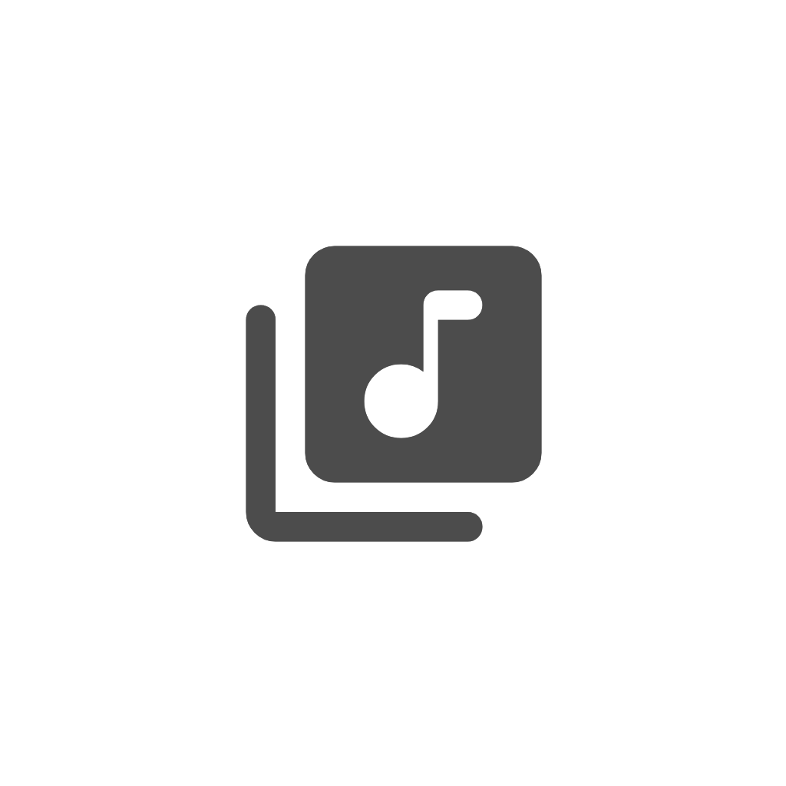
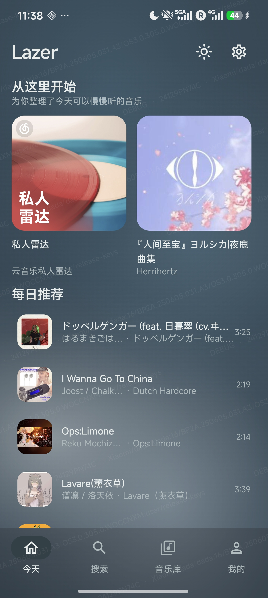
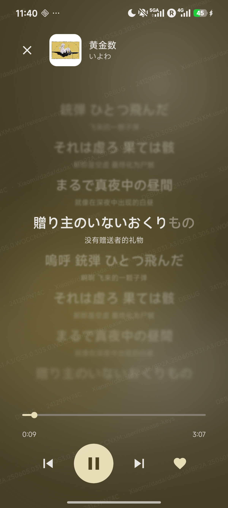
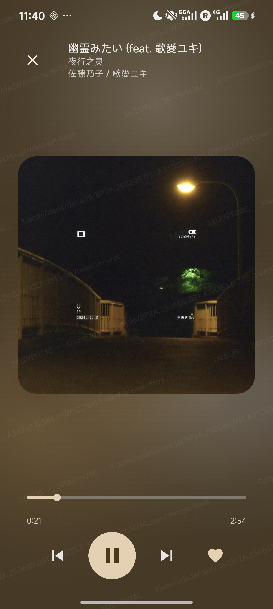
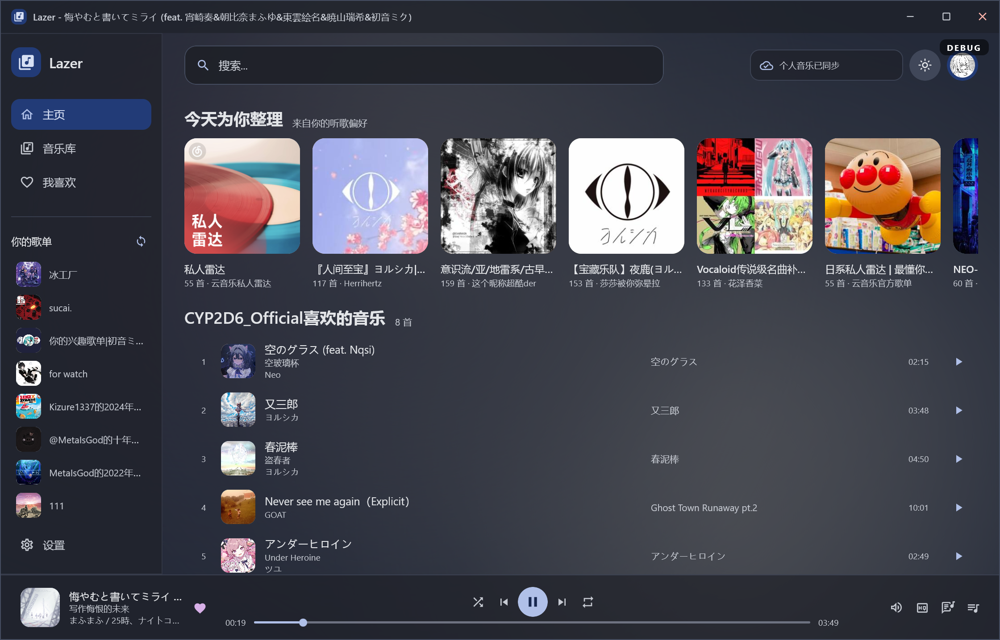
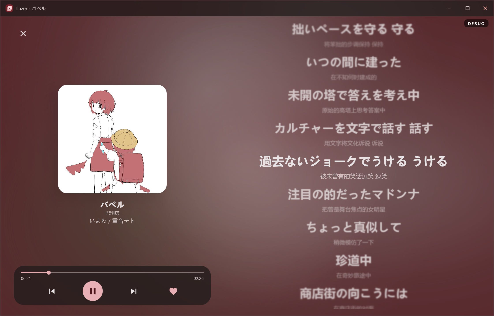
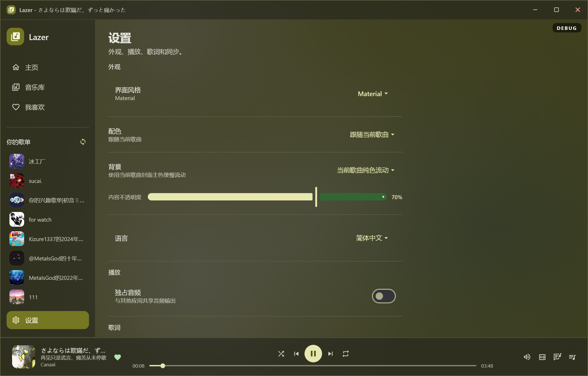
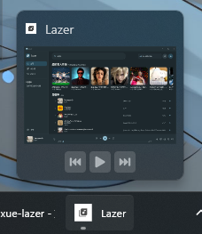
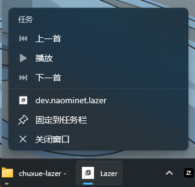

<p align="center">
  
</p>

<h1 align="center">Lazer</h1>

<p align="center">一个安静、专注的跨平台音乐播放器。</p>

<p align="center">
  <strong>Android</strong> · <strong>iOS</strong> · <strong>Desktop</strong>
</p>

## 项目简介

Lazer 是一个基于 Kotlin Multiplatform 和 Compose Multiplatform 构建的音乐客户端。项目将界面与核心 Gateway 数据模型放在共享模块中，再通过 Android、iOS 和 JVM Desktop 平台实现播放、持久化和系统集成。

API Gateway 已内置于共享模块中，直接与音乐服务通信，无需部署或配置额外的云端 Gateway 服务。

## Screenshot

### 移动端

<p align="center">
  
  
  
</p>

### 桌面端

<p align="center">
  
  
  
</p>

<p align="center">
  
  
</p>

## 功能

- 音乐搜索、热门发现和推荐内容浏览
- 歌单浏览，支持登录后同步个人歌单
- 歌曲播放、暂停、上一首、下一首、进度跳转和音量控制
- Android 前台播放服务与通知栏媒体控制
- Desktop 系统媒体会话与媒体按键控制
- LRC 歌词解析、翻译歌词合并和播放进度跟随
- QR 登录、手机号验证码登录、手机号密码登录和邮箱登录
- 登录状态持久化，退出登录时清理本地会话
- 歌单、歌曲和音频缓存，优先恢复本地内容再刷新网络数据
- 浅色/深色主题、Material 3 与 MIUIX 主题引擎切换
- Desktop 支持 Windows ARM64、Windows x64，以及 macOS/Linux 原生分发格式

## 技术栈

- Kotlin `2.4.10`
- Kotlin Multiplatform
- Compose Multiplatform `1.10.3`
- Compose Material 3
- Ktor `3.5.2`
- Kotlinx Serialization
- Coil 3
- ZXing（Desktop 二维码生成）
- JavaMP3（Desktop 音频解码）
- Nucleus Media Control（Desktop 系统媒体控制）
- Gradle Wrapper

## 项目结构

```text
Lazer/
├── androidApp/                         # Android 应用、播放服务和 Android 平台存储
├── desktopApp/                         # JVM Desktop 应用、音频播放器和系统媒体控制
├── iosApp/                             # iOS SwiftUI 入口与 Xcode 工程
├── shared/                             # 共享 UI、Gateway、数据模型、主题和跨平台逻辑
│   └── src/
│       ├── commonMain/                 # 所有平台共享代码
│       ├── commonTest/                 # 共享单元测试
│       ├── androidMain/                # Android 网络实现
│       ├── iosMain/                    # iOS 网络与 Compose 入口
│       └── jvmMain/                    # Desktop 网络实现
├── gradle/                             # Version Catalog 与 Gradle 配置
├── newicon.png                         # 项目图标
└── run-desktop.bat                     # Windows Desktop 快捷启动脚本
```

## 环境要求

- JDK 11 或更高版本
- Android Studio（Android 开发与构建）
- Xcode（仅 macOS，iOS 开发与构建）

项目使用 Gradle Wrapper，通常不需要单独安装 Gradle。

## 快速开始

### Android

构建 Debug APK：

```bash
./gradlew :androidApp:assembleDebug
```

Windows PowerShell：

```powershell
.\gradlew.bat :androidApp:assembleDebug
```

生成的构建产物位于 `androidApp/build/outputs/` 下。

### Desktop

标准运行：

```bash
./gradlew :desktopApp:run
```

Windows ARM64 或 IntelliJ IDEA 中运行：

```bash
./gradlew :desktopApp:runDesktop
```

Windows 也可以直接执行：

```bat
run-desktop.bat
```

开发期间启用自动重载：

```bash
./gradlew :desktopApp:hotRun --auto
```

指定 Windows 原生架构：

```bash
./gradlew :desktopApp:runDesktop -PwindowsArch=x64
./gradlew :desktopApp:runDesktop -PwindowsArch=arm64
```

### iOS

iOS 目标仅在 macOS 主机上注册。使用 Xcode 打开 [`iosApp`](./iosApp) 目录，然后选择模拟器或已连接设备运行。

## 测试

运行共享模块的 Android Host 测试：

```bash
./gradlew :shared:testAndroidHostTest
```

运行 Desktop/JVM 测试：

```bash
./gradlew :shared:jvmTest
./gradlew :desktopApp:test
```

在 macOS 上运行 iOS Simulator 测试：

```bash
./gradlew :shared:iosSimulatorArm64Test
```

## Gateway 连接

应用已内置 API Gateway，开箱即用，无需额外配置。登录会话 Cookie 会在各平台的安全存储中持久化，登录后自动生效。

## 发布构建

### Desktop 分发包

Desktop 配置了以下原生分发格式：

- Windows MSI
- macOS DMG
- Linux DEB

构建全部 Desktop 分发包：

```bash
./gradlew :desktopApp:createDistributable
```

Windows 图标资源位于 [`desktopApp/src/main/resources/icon.ico`](./desktopApp/src/main/resources/icon.ico)，运行时窗口图标使用 [`icon.png`](./desktopApp/src/main/resources/icon.png)。

### Android Release

Release 构建要求签名配置。可以通过环境变量提供：

```text
LAZER_KEYSTORE_FILE
LAZER_KEYSTORE_PASSWORD
LAZER_KEY_ALIAS
LAZER_KEY_PASSWORD
```

也可以在项目根目录创建 `keystore.properties`，字段名对应 `storeFile`、`storePassword`、`keyAlias` 和 `keyPassword`。请勿将真实密钥、密码或签名文件提交到版本库。

## 数据与隐私

- Gateway 登录会话保存在平台私有存储中
- Android 会话使用 Android Keystore 保护
- Desktop 会话保存在用户目录下的 `.lazer/state.properties`
- Desktop 播放日志不会记录音频流 URL、账户信息或凭据
- Gateway 请求失败时会避免在异常信息中暴露会话 Cookie

## 开发约定

- 共享功能优先放入 `shared` 模块，平台专属能力放入对应的 `androidMain`、`iosMain` 或 `jvmMain`
- 颜色、排版、间距和交互优先复用 `LazerTheme.kt` 中的设计令牌
- 用户可见文案使用简洁自然的中文
- 内置 Gateway 的新增路由需同时补充协议编码与传输映射，并在 `shared` 的网关测试中覆盖
- 不要提交 `build/`、本地配置、密钥、密码或发布签名文件

## 许可证

本项目采用 [MIT License](./LICENSE) 开源。 Copyright (c) 2026 Lazer contributors。
